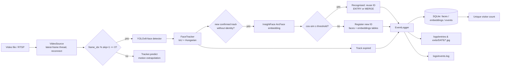

# Intelligent Face Tracker with Auto-Registration & Unique Visitor Counting

Real-time pipeline: **YOLOv8-face** (detection) → **IoU/velocity tracker** (Hungarian matching) →
**InsightFace ArcFace (buffalo_l, 512-d)** (embedding / re-identification) → **SQLite + image store + `events.log`**.
Works on a video file (dev) and on a live **RTSP** stream (interview) with the same command.

> 🎥 **Demo / Explanation Video:** [https://www.loom.com/share/314ecd49571641aa925b249379ce5acc](https://www.loom.com/share/314ecd49571641aa925b249379ce5acc)

---
## 1. Quick start
```bash
python -m venv venv && source venv/bin/activate        # Windows: venv\Scripts\activate
pip install -r requirements.txt                         # GPU: pip uninstall onnxruntime && pip install onnxruntime-gpu
python scripts/download_weights.py                      # optional: pre-fetch models (YOLO face + buffalo_l)

# --- Option A: Interactive Web Dashboard (Recommended) ---
python web_app.py                                       # Open http://localhost:5000 in browser

# --- Option B: Terminal / CLI Execution ---
# put the provided video at data/sample_video.mp4  (or change "video_source" in config.json)
python main.py --fresh                                  # video file
python main.py --fresh --source "rtsp://user:pass@IP:554/stream"   # live RTSP
python main.py --show                                   # live preview window (press q to quit)
python scripts/report.py                                # unique count + events from the DB
python -m tests.test_pipeline_mock                      # logic test (no models needed)
```
Outputs: `logs/events.log`, `logs/entries/YYYY-MM-DD/*.jpg`, `logs/exits/YYYY-MM-DD/*.jpg`,
`data/visitors.db`, `output/annotated.mp4`.

## 2. config.json
```json
{
  "video_source": "data/sample_video.mp4",
  "detection_skip_frames": 2,
  "detector":    { "weights_path": "models/yolov8n-face.pt", "confidence": 0.5, "nms_iou": 0.45,
                   "image_size": 640, "device": "auto", "min_face_size_px": 32 },
  "recognition": { "model_pack": "buffalo_l", "det_size": 320, "similarity_threshold": 0.40,
                   "max_embeddings_per_identity": 5, "max_attempts_per_track": 8, "min_sharpness": 10.0,
                   "gallery_refresh_every_n_cycles": 20, "crop_margin": 0.25 },
  "tracking":    { "iou_threshold": 0.25, "min_hits": 2, "max_age_frames": 45, "tentative_max_age_frames": 10 },
  "storage":     { "log_dir": "logs", "db_path": "data/visitors.db", "reset_on_start": false },
  "stream":      { "reconnect_delay_sec": 3, "max_reconnect_attempts": 20 },
  "output":      { "show_window": false, "save_annotated_video": true, "annotated_path": "output/annotated.mp4" }
}
```
`detection_skip_frames = N` → full YOLO detection runs on every (N+1)-th frame (N=2 ⇒ every 3rd frame);
boxes are extrapolated in between. Raise it for CPU-only machines / many streams.

## 3. AI planning document
**Problem.** Count *unique* people in a video stream; log exactly one entry and one exit per appearance with evidence.

**Features**
| # | Feature | Where |
|---|---------|-------|
| F1 | YOLOv8 face detection, configurable frame skipping | `src/detector.py`, `config.json` |
| F2 | ArcFace (InsightFace) embeddings with landmark alignment | `src/recognizer.py` |
| F3 | Auto-registration of unseen faces with unique ID + metadata | `src/pipeline.py`, `src/database.py` |
| F4 | Re-identification via cosine similarity gallery (multi-embedding per ID) | `Gallery` in `src/pipeline.py` |
| F5 | Multi-face tracking (IoU + velocity, Hungarian, 2-pass) | `src/tracker.py` |
| F6 | Exactly-once ENTRY / EXIT events with cropped image, timestamp, type, ID | `src/event_logger.py` |
| F7 | Structured log file for every critical event | `src/logging_setup.py` → `logs/events.log` |
| F8 | Unique count from DB (`SELECT COUNT(*) FROM faces`) | `src/database.py`, `scripts/report.py` |
| F9 | File **and** RTSP input with threaded latest-frame reader + auto-reconnect | `src/video_source.py` |
| F10 | Crash resilience: SQLite WAL + sync FULL, atomic image writes, per-frame try/except, graceful SIGINT flush, gallery reload on restart | `main.py`, `src/database.py` |
| F11 | Annotated output video / live preview | `src/visualize.py` |
| F12 | Full-featured Real-time Web Dashboard (MJPEG live stream, SSE events, Visitor Gallery, Video Upload) | `web_app.py`, `frontend/` |

**Key design decisions**
* *Detect-then-embed only when needed*: the (expensive) ArcFace model runs once per new track (plus rare refreshes), not per frame.
* *Exactly-once events*: a track emits ENTRY when it first gets an identity and EXIT when unseen for `max_age_frames`; flags make double logging impossible.
* *No over-counting from track breaks*: if a face is re-recognised while its old track is only "lost", the tracks are **merged** (no new ID, no extra events). If the person truly left and returns, it is a new ENTRY of the *same* ID (count unchanged).
* *Quality gating*: tiny / blurry faces are skipped; best-quality crop (confidence × size × sharpness) is used as entry image.
* *Alignment*: InsightFace's SCRFD runs on the padded YOLO crop only to get 5 landmarks, so ArcFace sees an aligned 112×112 face (much more accurate than raw crops).

**Compute estimate** (approximate, 1080p→640 input; measure on your machine)
| Stage | CPU (4-8 core laptop) | GPU (T4/RTX class) |
|-------|----------------------|--------------------|
| YOLOv8n-face @640 | ~25-45 ms / detection cycle | ~3-6 ms |
| InsightFace det (320) + ArcFace r50 | ~60-120 ms per *new/refresh* face | ~8-15 ms |
| Tracker + IO + DB | <2 ms / frame | <2 ms |
| Effective load @25 FPS, skip=2 | ~8 detection cycles/s ≈ 25-40 % of a CPU core-set; real-time OK | <10 % GPU |
RAM ≈ 1.5-2 GB (models + frames). Disk: ≈ 10-30 KB per event image.

## 4. Architecture


## 5. Database schema
`faces(face_id, label, registered_at, first_image_path, visit_count)` ·
`embeddings(id, face_id, vector BLOB, created_at)` ·
`events(id, face_id, event_type['entry'|'exit'], timestamp, video_time_sec, frame_idx, track_id, image_path)`

## 6. Sample output
Run `python main.py --fresh` on the provided video, then commit `logs/`, `data/visitors.db` and a screenshot of
`python scripts/report.py`. Log format:
```
ENTRY | face=FACE-0001 | track=1 | frame=3 | video_t=0.12 | image=logs/entries/2026-10-04/FACE-0001_entry_….jpg | new_face=True
EXIT  | face=FACE-0001 | track=1 | frame=120 | video_t=4.8  | image=logs/exits/2026-10-04/FACE-0001_exit_….jpg  | reason=left_frame
```

## 7. Assumptions & limitations
* An "exit" = a face unseen for `max_age_frames` (default 45 ≈ 1.8 s @25 FPS); entry/exit are per *appearance*; the same person returning later gets a new entry/exit pair under the same ID.
* Entry timestamp = wall-clock time when identity was established; exit timestamp = last time the face was seen. `video_time_sec` is stored too.
* Similarity threshold 0.40 suits buffalo_l; tune on the sample video (lower → fewer duplicate IDs, higher → fewer false merges).
* Faces smaller than 32 px or heavily blurred are ignored; extreme profile views may fail alignment and are retried.
* Identical twins / heavy masks can be confused. Single camera only.

## 8. AI-assisted workflow
Planning → feature list → compute estimate → modular code generation → mock-model logic test → tuning on sample video.
Prompts used are recorded in `docs/PROMPTS.md`.

---
This project is a part of a hackathon run by https://katomaran.com
